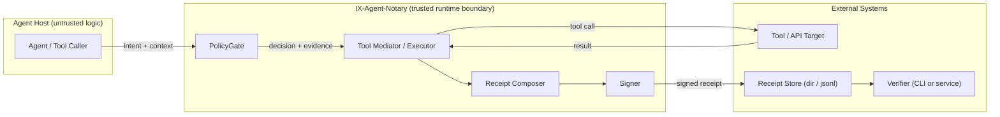

# IX-Agent-Notary Architecture

## Problem statement

When an agent can call tools such as code hosts, CI/CD, cloud APIs, ticketing systems, secrets managers, or production operations, the real enterprise question is:

**What exactly did the agent do, under what policy, with what approvals, and can we prove it?**

IX-Agent-Notary exists to make **policy enforcement plus verifiable evidence** a first-class part of agent/tool execution.

## Design goals

1. **Tamper-evident receipts** for every meaningful action
2. **Strict verification** so placeholders or unverifiable evidence can be rejected
3. **Small trusted boundary** so the core is reviewable
4. **Composable storage** so receipts can live in a directory or append-only log
5. **Chainable evidence** so multi-step workflows can be followed across receipts

## Main components

### PolicyGate

Evaluates a policy pack and returns:

- allow or deny
- matched rule evidence
- reason text
- policy identity metadata

### Tool mediator or executor

Represents the path through which tool actions are executed or simulated after policy evaluation.

### Receipt composer

Builds the receipt object, including:

- action fields
- policy evidence
- result fields
- trace metadata
- integrity envelope

### Canonicalizer and signer

Canonicalizes the payload with RFC8785-JCS, computes core hashes, and signs the receipt.

### Verifier

Checks:

- schema validity
- core hashes
- receipt signature
- approval signatures when requested
- parent linkage and step consistency when strict chain validation is enabled

## Canonical data flow

## Trust boundaries

### Trusted boundary

These pieces should stay small, reviewable, and hardened:

- policy evaluator
- receipt construction
- canonicalization
- signing logic
- verification logic

### Untrusted or assumed-fallible

Assume these can be wrong, manipulated, or compromised:

- agent planning or orchestration logic
- prompts or LLM outputs
- upstream tool-selection code
- tool response content

Principle: assume the agent is fallible. Trust enforcement plus receipts, not the agent’s own story.

## Receipt chain model

Receipts can form an evidence chain across a workflow.

Relevant fields:

- `trace.trace_id`
- `trace.step`
- optional `trace.parent_receipt_id`

Strict chain validation currently enforces:

- parent receipt must exist
- parent and child must share the same `trace_id`
- parent `step` must equal child step minus one
- the root receipt must end at step `1`
- cycles are rejected

That gives the verifier a way to detect broken or inconsistent parent linkage in multi-step evidence.

## Storage model

v0 keeps storage intentionally simple:

- individual JSON receipts in a directory
- append-only JSONL log pattern

The store itself is **not** assumed trustworthy. The trust comes from verification.

## Key posture

This repo does not ship private keys.

For local evaluation:

- generate a dev keypair locally
- generate local demo receipts
- verify them strictly

For production:

- use KMS or HSM backed keys
- publish a trusted public-key allowlist
- rotate keys without invalidating old receipts

See `docs/KEY_MANAGEMENT.md`.

## What this architecture is and is not

IX-Agent-Notary is:

- a control-point pattern for agent/tool execution
- an evidence format plus verification path
- a narrow trust layer that security teams can reason about

IX-Agent-Notary is not:

- a general-purpose agent framework
- a full SIEM
- a guarantee that tool outputs are truthful
- a replacement for IAM, host hardening, or network controls
